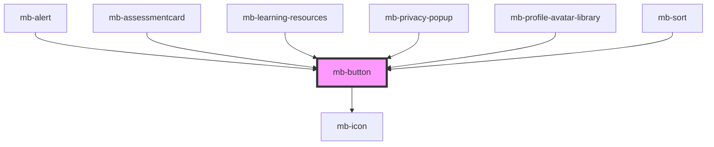

# mb-button

<!-- Auto Generated Below -->

## Properties

| Property            | Attribute           | Description | Type                                                                                             | Default         |
| ------------------- | ------------------- | ----------- | ------------------------------------------------------------------------------------------------ | --------------- |
| `buttonAriaLabel`   | `button-aria-label` |             | `string`                                                                                         | `undefined`     |
| `buttonID`          | `button-i-d`        |             | `string`                                                                                         | `undefined`     |
| `buttonToolTip`     | `button-tool-tip`   |             | `string`                                                                                         | `undefined`     |
| `disabled`          | `disabled`          |             | `boolean`                                                                                        | `false`         |
| `formButton`        | `form-button`       |             | `boolean`                                                                                        | `false`         |
| `handlebuttonclick` | --                  |             | `Function`                                                                                       | `() => {}`      |
| `leadingIcon`       | `leading-icon`      |             | `string \| { icon: string; iconColor?: string; pathNumber?: number; iconSize?: IconSizesType; }` | `undefined`     |
| `shouldtruncate`    | `shouldtruncate`    |             | `boolean`                                                                                        | `false`         |
| `size`              | `size`              |             | `"large" \| "medium" \| "small" \| "xlarge"`                                                     | `Sizes.Medium`  |
| `ssoButton`         | `sso-button`        |             | `boolean`                                                                                        | `false`         |
| `testId`            | `test-id`           |             | `string`                                                                                         | `undefined`     |
| `text`              | `text`              |             | `string`                                                                                         | `undefined`     |
| `trailingIcon`      | `trailing-icon`     |             | `string \| { icon: string; iconColor?: string; pathNumber?: number; iconSize?: IconSizesType; }` | `undefined`     |
| `type`              | `type`              |             | `"auth" \| "borderless" \| "primary" \| "secondary"`                                             | `Types.Primary` |

## Dependencies

### Used by

 - [mb-alert](../mb-alert)
 - [mb-assessmentcard](../mb-assessmentcard)
 - [mb-learning-resources](../mb-learning-resources)
 - [mb-privacy-popup](../mb-privacy-popup)
 - [mb-profile-avatar-library](../mb-profile-widget/mb-profile-avatar-library)
 - [mb-sort](../mb-sort)

### Depends on

- [mb-icon](../mb-icon)

### Graph

----------------------------------------------

*Built with [StencilJS](https://stenciljs.com/)*
