# mb-icon

<!-- Auto Generated Below -->

## Properties

| Property            | Attribute             | Description | Type                                                                                | Default           |
| ------------------- | --------------------- | ----------- | ----------------------------------------------------------------------------------- | ----------------- |
| `ariaCheckedValue`  | `aria-checked-value`  |             | `string`                                                                            | `undefined`       |
| `ariaExpandedValue` | `aria-expanded-value` |             | `boolean`                                                                           | `undefined`       |
| `ariaLabelValue`    | `aria-label-value`    |             | `string`                                                                            | `undefined`       |
| `ariaPressedValue`  | `aria-pressed-value`  |             | `boolean`                                                                           | `undefined`       |
| `color`             | `color`               |             | `string`                                                                            | `'icons'`         |
| `disabled`          | `disabled`            |             | `boolean`                                                                           | `false`           |
| `focusable`         | `focusable`           |             | `boolean`                                                                           | `true`            |
| `handleiconclick`   | --                    |             | `Function`                                                                          | `() => {}`        |
| `icon` _(required)_ | `icon`                |             | `string`                                                                            | `undefined`       |
| `iconId`            | `icon-id`             |             | `string`                                                                            | `undefined`       |
| `iconRole`          | `icon-role`           |             | `string`                                                                            | `undefined`       |
| `pathnumber`        | `pathnumber`          |             | `number`                                                                            | `0`               |
| `size`              | `size`                |             | `"large" \| "medium" \| "micro" \| "mini" \| "regular" \| "small" \| "xl" \| "xxl"` | `IconSizes.Small` |
| `testId`            | `test-id`             |             | `string`                                                                            | `undefined`       |
| `toolTip`           | `tool-tip`            |             | `string`                                                                            | `undefined`       |
| `type`              | `type`                |             | `"button" \| "iTag"`                                                                | `'button'`        |

## Dependencies

### Used by

 - [mb-accordian](../mb-accordian)
 - [mb-bookmark-item](../mb-bookmark-item)
 - [mb-button](../mb-button)
 - [mb-button-group](../mb-button-group)
 - [mb-card](../mb-card)
 - [mb-carousel](../mb-carousel)
 - [mb-carousel-component](../mb-carousel-component)
 - [mb-checkbox](../mb-checkbox)
 - [mb-dropdown](../mb-dropdown)
 - [mb-feedback-message](../mb-feedback-message)
 - [mb-filter-tag](../mb-filter-tag)
 - [mb-graded-stats](../mb-graded-stats)
 - [mb-highlighted-item](../mb-highlighted-item)
 - [mb-horizontal-scroll](../mb-horizontal-scroll)
 - [mb-icon-metadata](../mb-icon-metadata)
 - [mb-input](../mb-input)
 - [mb-learning-resources](../mb-learning-resources)
 - [mb-lesson-accordion](../mb-lesson-accordion)
 - [mb-localization](../mb-localization)
 - [mb-message](../mb-message)
 - [mb-nav-icon](../mb-nav-icon)
 - [mb-notification](../mb-notification)
 - [mb-player-header](../mb-player-header)
 - [mb-popover-component](../mb-popover-component)
 - [mb-popup](../mb-popup)
 - [mb-question-list](../mb-question-list)
 - [mb-resource-type](../mb-resource-type)
 - [mb-search](../mb-search)
 - [mb-searchable-dropdown](../mb-searchable-dropdown)
 - [mb-single-chapter](../mb-single-chapter)
 - [mb-slider](../mb-slider)
 - [mb-sort](../mb-sort)
 - [mb-text-input](../mb-text-input)
 - [mb-toaster](../mb-toaster)
 - [mb-widget](../mb-widget)

### Graph

```mermaid
graph TD;
  mb-accordian --> mb-icon
  mb-bookmark-item --> mb-icon
  mb-button --> mb-icon
  mb-button-group --> mb-icon
  mb-card --> mb-icon
  mb-carousel --> mb-icon
  mb-carousel-component --> mb-icon
  mb-checkbox --> mb-icon
  mb-dropdown --> mb-icon
  mb-feedback-message --> mb-icon
  mb-filter-tag --> mb-icon
  mb-graded-stats --> mb-icon
  mb-highlighted-item --> mb-icon
  mb-horizontal-scroll --> mb-icon
  mb-icon-metadata --> mb-icon
  mb-input --> mb-icon
  mb-learning-resources --> mb-icon
  mb-lesson-accordion --> mb-icon
  mb-localization --> mb-icon
  mb-message --> mb-icon
  mb-nav-icon --> mb-icon
  mb-notification --> mb-icon
  mb-player-header --> mb-icon
  mb-popover-component --> mb-icon
  mb-popup --> mb-icon
  mb-question-list --> mb-icon
  mb-resource-type --> mb-icon
  mb-search --> mb-icon
  mb-searchable-dropdown --> mb-icon
  mb-single-chapter --> mb-icon
  mb-slider --> mb-icon
  mb-sort --> mb-icon
  mb-text-input --> mb-icon
  mb-toaster --> mb-icon
  mb-widget --> mb-icon
  style mb-icon fill:#f9f,stroke:#333,stroke-width:4px
```

----------------------------------------------

*Built with [StencilJS](https://stenciljs.com/)*
